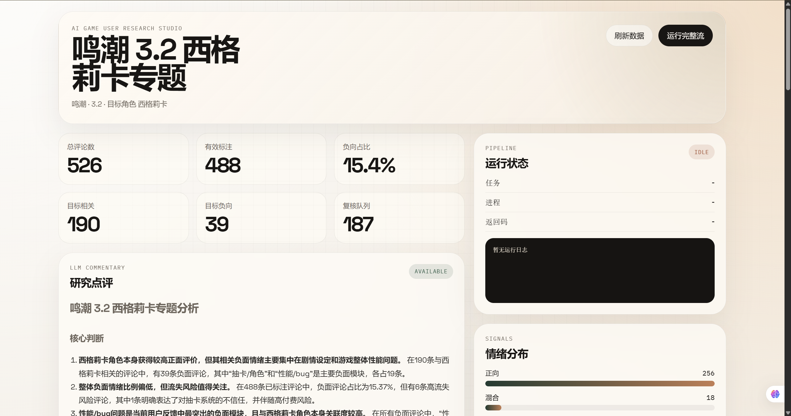
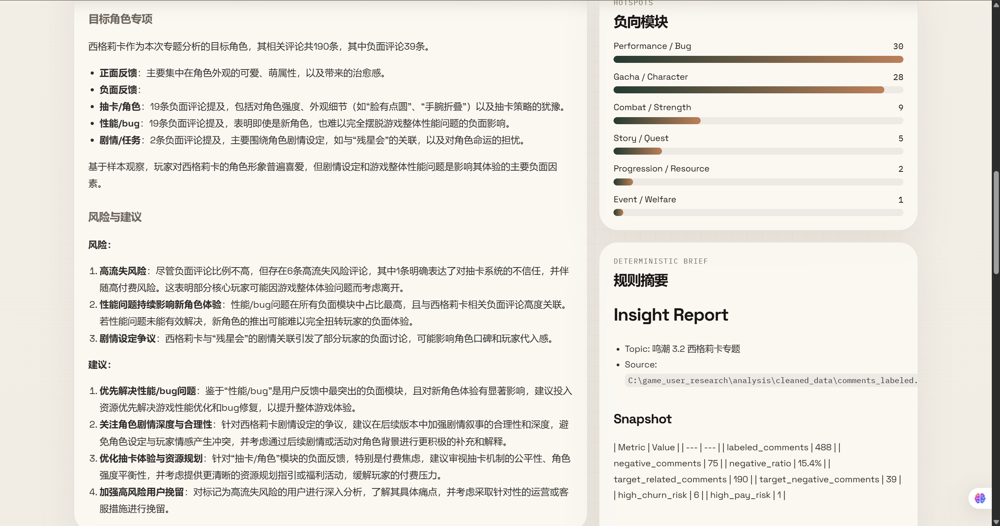
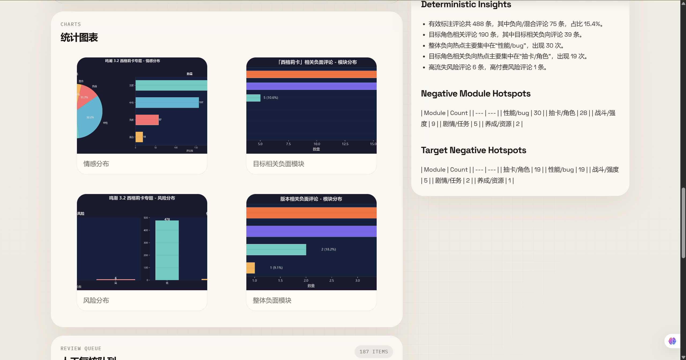
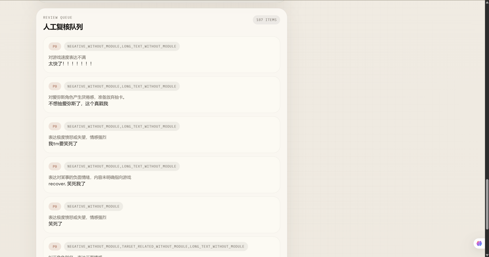

# Demo 数据快照

这个目录用于放可以直接随仓库展示的 demo 数据、页面截图和启动脚本，不依赖重新抓数或重新调用 LLM。

## 目录结构

- `data/`：可直接被后端读取的 demo 快照
- `figure/`：README 预览截图
- `run_demo.py`：以指定快照启动 FastAPI 和 dashboard
- `README.md`：demo 使用说明

当前默认快照：`demo/data/wuwa_3_2_xigelika/`

## 一键运行 Demo

先安装依赖：

```bash
uv sync
```

然后启动 demo：

```bash
python demo/run_demo.py
```

启动后访问：

- Dashboard：`http://127.0.0.1:8000/studio/`
- API 文档：`http://127.0.0.1:8000/docs`

## 页面预览

### Dashboard Overview



### Analysis Views

<p align="center">
  
  
</p>

### Review Queue



## 快照内容

每个快照目录包含：
- `data/comments_labeled.csv`：已完成结构化标注的评论结果
- `data/comments_cleaned.csv`：清洗后的评论数据
- `data/label_routing_report.json`：标注路由统计
- `charts/*.png`：分析图表
- `reports/insight_report.md`：洞察报告，包含 LLM 点评
- `reports/label_review_queue.csv`：人工复核队列
- `config/project.yaml`：对应专题配置
- `manifest.json`：快照元信息

## 不包含内容

- `.env`
- 原始爬虫数据
- `_label_cache.jsonl`、`_label_failures.jsonl` 这类运行时缓存
- 外部抓取器 `MediaCrawler`

如需重新跑完整分析，使用仓库根目录下的 `analysis/` 和 `backend/` 主流程。
